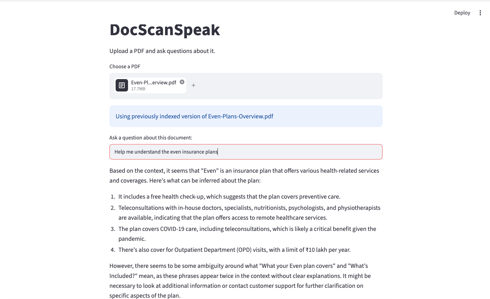

# Docs Can Speak

A local RAG (Retrieval-Augmented Generation) chatbot that answers questions from personal documents. Built from scratch as a hands-on path into AI Engineering — this README documents not just what the project does, but the core AI engineering concepts understood while building each stage.

## What it does

AI Aspiration Project 1 (LLM, Chunks using CromaDB, RAGS, StreamLit)

Ask a question about a document you own (a PDF ledger, notes, policy, etc.), and get an answer grounded in that document's actual content — with the source passages shown, so the answer can be verified rather than trusted blindly. Runs entirely locally, no cloud API, no cost per query.

## Demo



## Concepts learned, by stage

### Stage 1 — LLMs are stateless

Built a basic chat loop calling a local LLM (Llama 3.2 via Ollama).

**Core understanding:** an LLM API call has no memory of its own. Every single call only knows what's inside the `messages` list sent *at that moment*. "Conversation memory" isn't a model feature — it's an illusion created by the calling code appending every past turn (`role: user` / `role: assistant`) into that list and resending the entire growing history on each new call. This is the single idea everything else in the project builds on: **the model only ever sees what you explicitly hand it.**

### Stage 2 — Turning documents into searchable meaning

Built a pipeline: PDF → extracted text → chunks → embeddings → stored in a vector database (ChromaDB).

**Core understanding:**
- **Why chunking is necessary:** a whole document can't be usefully searched or fed to a model as one block — you need small, independently retrievable units. Chunk size is a real design tradeoff: too large and retrieval pulls back irrelevant surrounding text (observed directly — chunks from a dense ledger mixed relevant lines with unrelated ones); too small and you lose context.
- **Why overlap matters:** without overlapping chunk boundaries, a sentence or fact can get split across two chunks and become unretrievable in full from either one.
- **What an embedding actually is:** a numerical representation of meaning, not keywords. Two pieces of text with completely different wording but similar meaning end up close together in embedding space — this is what makes semantic search possible, as opposed to exact keyword matching.
- **Generative models vs. embedding models are different tools:** Llama 3.2 (generative, ~2GB) writes text. The embedding model bundled in ChromaDB, `all-MiniLM-L6-v2` (~80MB), only encodes meaning into numbers — it never generates language. Two different jobs, two different model sizes.

### Stage 3 — RAG is retrieval + a disciplined prompt

Connected retrieval to generation: a question is embedded, the most similar chunks are retrieved, and those chunks are inserted into the prompt before it's sent to the LLM.

**Core understanding:** "RAG" is not a special model capability — it's an engineering pattern. The mechanism is: retrieve relevant text → paste it into the prompt as context → instruct the model to answer *only* from that context. Grounding is enforced entirely through prompt instructions (explicitly telling the model to say "I don't know" if the answer isn't in the provided context), not through any special mode of the model. Verified this directly by asking an out-of-context question ("what's the capital of France?") and confirming the model correctly declined to answer from its own general knowledge.

### Stage 4 — Retrieval quality determines answer quality, and it should be visible

Wrapped the pipeline in a Streamlit UI and added a "show sources" panel displaying the exact retrieved chunks behind each answer.

**Core understanding:** in a RAG system, the LLM only ever writes fluent language around whatever was retrieved — if retrieval pulls the wrong or noisy chunks, no amount of prompting fixes the answer. Surfacing sources isn't just a UI nicety; it's how you audit and debug a RAG system, and how a user can actually trust (or catch) an answer instead of taking it on faith.

## Architecture

```
PDF → text extraction (pypdf) → chunking (overlapping segments)
    → embeddings + storage (ChromaDB)

question → embedded → semantic search → top-k relevant chunks
    → chunks + question inserted into prompt → LLM (Llama 3.2, local via Ollama)
    → grounded answer + visible sources (Streamlit)
```

## Tech stack

| Component | Tool | Reason |
|---|---|---|
| LLM | Llama 3.2 (Ollama) | Local inference, zero API cost, good for learning without billing pressure |
| Vector DB | ChromaDB | Local, ships with a built-in embedding model |
| PDF parsing | pypdf | Text extraction from PDF documents |
| UI | Streamlit | Pure Python, no separate frontend needed |

## Known limitations (deliberately left as-is for now)

- Chunking is fixed-size (character count), not structure-aware — a cleaner chunking strategy (per line/paragraph/transaction) would improve retrieval precision, especially on tabular data like the ledger used here.
- The RAG chat has no memory across turns — each question is independent (unlike the Stage 1 chat loop, which does have memory). Merging the two is a natural next step.
- Only tested against text-based PDFs — scanned/image-based PDFs would need OCR, not yet implemented.

## What's next

- Structure-aware chunking
- Multi-turn memory in the RAG flow
- Pluggable LLM backend (swap Ollama for Claude/OpenAI via a single function)
- Multiple documents per session
- RAG + tools → multi-agent behavior (longer-term direction)
